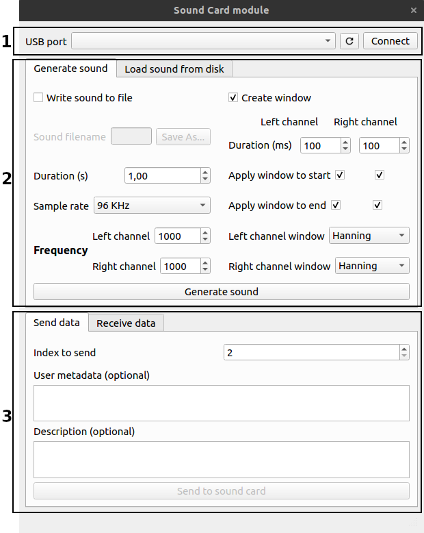
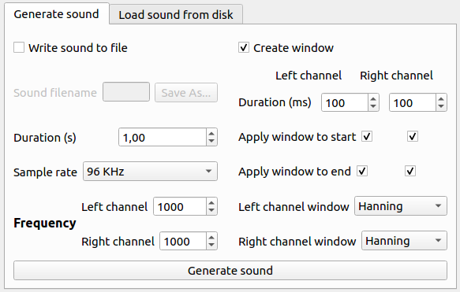

.. module:: pybpodapi
   :synopsis: top-level module

*************************************************
User interface
*************************************************

The main window that comprises the user interface of the SoundCard
Module is divided in three main sections as it can be seen in the
following Figure.

1. Connection to the Sound Card
2. Sound generation or loading sounds from the disk
3. Sending or receiving data to the Sound Card

   Main window for the SoundCard Module

1. Connection to the Sound Card
===============================

When connecting the Harp Sound Card to the computer, the device will
appear in the dropdown control for the USB port. If you connect it later,
or reset the Sound Card, you can press the refresh button to force a search
for connected devices.

After a device is connected and selected in the dropdown, you can
connect to it by pressing the Connect button.

.. note:: The operations in the bottom section of the window
          require that a connect is established. When you press
          Connect and a successful connection is made, the operations
          buttons will enable.

2. Sound generation or loading sounds from the disk
===================================================

If you want to send sounds to the Sound Card , it is necessary to either
generate a sound using the provided UI, or you can load it from the disk.

Generating sounds
-----------------
The UI allows to create sounds with a sinewave, with distinct frequencies for
the left and right channel. The duration of the sound can also be configured.
The two sample rates supported by the Harp Sound Card can be selected in the
sound generation portion of the UI.

   Generate sounds portion of the window

When pressing the **Generate sound** button, the sound will be generated and
it will be possible to send it to the Sound Card, at the bottom portion of the
UI.

.. note:: It is possible to generate a sound in memory and send it directly
          to the Sound Card. However, if you wish to save the generated
          sound to the disk, you can activate the checkbox **Write sound to
          file** and create a new file.

Loading sounds from disk
------------------------
To load a sound from the disk, two options are available. You can either load
a generated sound that was previously saved or you can load a WAV file (except
24bits WAV files).

   Load sound from disk portion of the window

The procedure to load a sound is pressing Browse and select the file. The
file will be loaded automatically. If there are loading errors, you will be
notified.

3. Sending or receiving data to the Sound Card
==============================================

Sending data to the Sound Card
------------------------------

Sending a sound to the Sound Card can be accompanied by some user metadata
and some description information. Those fields are optional and can be
defined in the UI.

.. warning:: The **user metadata** field has a limit of 1024 bytes and the
             **description** field has a limit of 512 bytes. Any data that
             passes this limit will be **truncated**.

   Send data portion of the window

After selecting the index to where to write the sound and data, by pressing the
**Send to sound card** button will send the sound and data to the Harp Sound
Card.

.. note:: The index to where to save the sound must be **greater or equal** than 2
          and **lower** than 32. The interface will limit the input to those values.

Receiving data from the Sound Card
----------------------------------

In the same manner that it is possible to send additional data with the sound
(user metadata and a description), when receiving data from the Sound Card,
that data will also be written in the destination folder, if it exists.

The UI allows to receive the data from a single index or from all the indexes.

   Receive data portion of the window

The procedure to receive data from the Sound Card is by selecting a destination
folder, by pressing the **Browse** button, and selecting if the application
should clear the destination folder or not.

.. warning:: Even if the destination folder is not cleared, the files will be
             overwritten if they already exist.